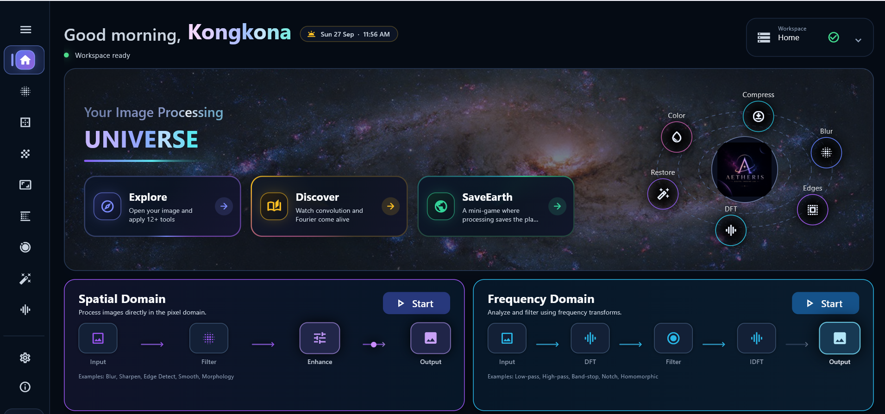
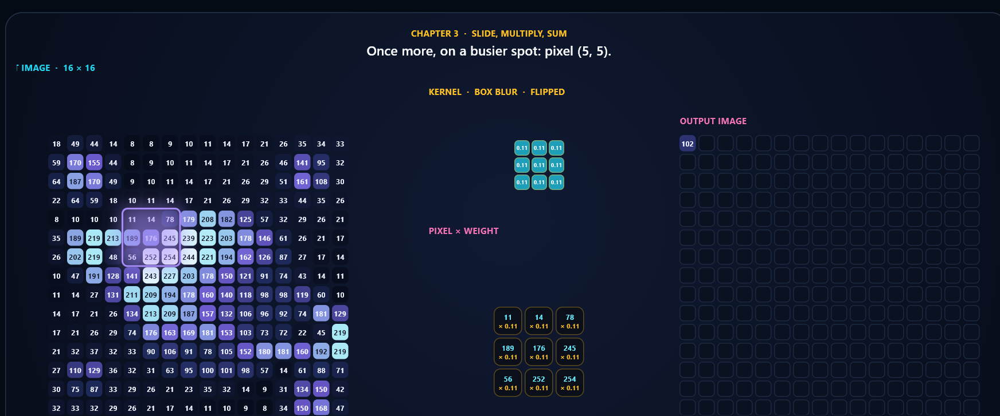
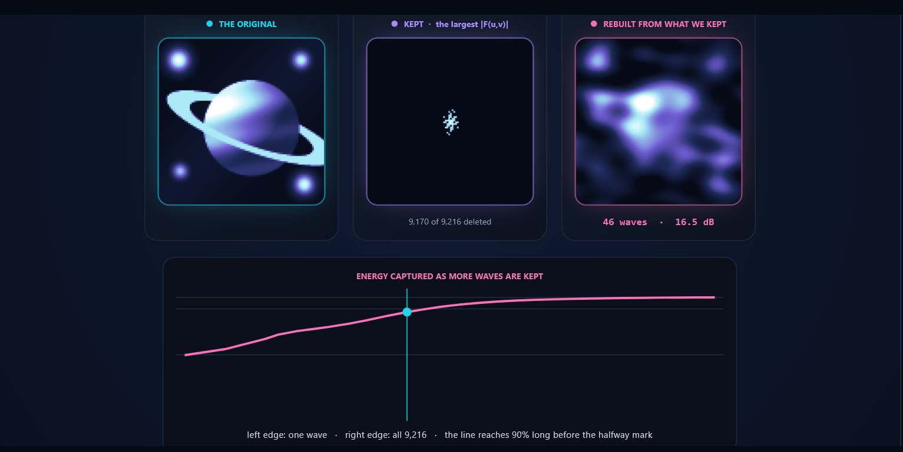
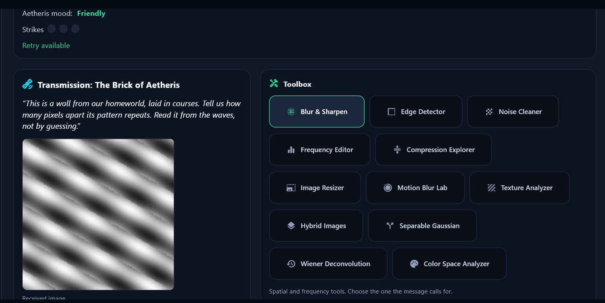

<div align="center">


<h1>AETHERIS &nbsp;·&nbsp; Image Signal Processor &amp; Editor</h1>

<p><strong>Learn it. See it. Play it. — 12 image-processing tools built on hand-written 2D convolution and 2D DFT</strong></p>

<p>
  
  &nbsp;
  
  &nbsp;
  
</p>

<p>
  
  
  
  
  
</p>

<br />

> *"Every image edit is a filter — applied either to the pixels or to the waves."*

<br />

</div>



---

## The Problem

Image editors hide the signal processing. Blur, sharpen, denoise or a JPEG save is just a button, and the mathematics behind it stays invisible. Students learn convolution and the Fourier transform on paper, but rarely see **both routes to the same result** working on a real image.

AETHERIS was built to make that visible:

1. **Implement the cores by hand** — a manual 2D convolution and a manual 2D DFT, reused by every tool.
2. **Measure, don't eyeball** — every before/after comparison reports **PSNR** from one shared utility.
3. **Teach and test** — animated lessons explain each idea, and a game checks whether you can pick the right filter.

---

## What It Does

<table>
<tr>
<td width="33%" valign="top">

### 🧭 Explore · Edit
Open your own image and apply **12 processing tools**: 7 in the spatial domain (convolution) and 5 in the frequency domain (DFT). Original and processed previews side by side, live parameter controls, spectra, histograms and PSNR.

</td>
<td width="33%" valign="top">

### 📖 Discover · Learn
**9 animated lessons** in the 3Blue1Brown style, on one fixed space image. Pause, jump chapters, edit the kernel, click any pixel. Every number on screen is computed by the real algorithms and checked by `verify()`.

</td>
<td width="33%" valign="top">

### 🌍 SaveEarth · Play
Aliens from planet **Aetheris** speak only in images. Answer their 5 transmissions with the right tool and setting — judged by PSNR against a hidden target — or Earth is erased.

</td>
</tr>
</table>

---

## The 12 Features

| # | Feature | Domain | Method | Owner |
|---|---|---|---|---|
| 1 | **Image Blur & Sharpen** | Spatial | Box blur, sharpen kernel, editable 3×3–7×7 kernel grid | Dola |
| 2 | **Edge Detector** | Spatial | Sobel $G_x$, $G_y$, magnitude $\sqrt{G_x^2+G_y^2}$; all three modes in one pass | Dola |
| 3 | **Image Noise Cleaner** | Spatial | Gaussian / salt-and-pepper noise; mean, Gaussian and median filters | Dola |
| 4 | **Image Frequency Editor** | Frequency | Spectrum $\lvert F(u,v)\rvert$, circular low/high-pass masks $M(u,v)$, inverse DFT | Shreya |
| 5 | **Image Compression Explorer** | Frequency | Keep only the largest DFT coefficients, rebuild, report PSNR | Shreya |
| 6 | **Image Resizer** | Spatial | Nearest vs bilinear; Gaussian anti-aliasing before downsampling | Dola |
| 7 | **Motion Blur Lab** | Spatial | Line kernel of length $L$ at angle $\theta$ (weights sum to 1) | Dola |
| 8 | **Texture Analyzer** | Frequency | Dominant spectral peak → repeat spacing and direction, no ML | Shreya |
| 9 | **Hybrid Images** | Frequency | Low frequencies of image A + high frequencies of image B | Shreya |
| 10 | **Gaussian Blur with Separability** | Spatial | $K\times K$ kernel as a row pass then a column pass | Dola |
| 11 | **Wiener Deconvolution** | Spatial / restoration | Reflect-padded FFT restoration vs naive inverse filtering | Dola |
| 12 | **Color Channel / Color Space Analyzer** | Frequency | RGB histograms and spectra, YCbCr (luma vs chroma) | Shreya |

---

## Theory

Everything in AETHERIS is filtering, done either in the spatial domain or in the frequency domain.

**2D convolution** — the core of all spatial tools (`algorithms/spatial/convolution.py`):

$$g(x,y)=\sum_{i=-a}^{a}\sum_{j=-b}^{b} h(i,j)\,f(x-i,\;y-j)$$

**2D Discrete Fourier Transform** — the core of all frequency tools (`manual_dft2`):

$$F(u,v)=\sum_{x=0}^{M-1}\sum_{y=0}^{N-1} f(x,y)\,e^{-j2\pi\left(\frac{ux}{M}+\frac{vy}{N}\right)}$$

**Convolution theorem** — the bridge between the two halves of the app:

$$f * h \;\Longleftrightarrow\; F\cdot H \qquad\Rightarrow\qquad g=\mathcal{F}^{-1}\{F\cdot H\}$$

**Wiener deconvolution** — $K=0$ is the naive inverse $1/H$; $K>0$ keeps noise from exploding at spectral nulls:

$$\hat{F}(u,v)=\frac{H^{*}(u,v)}{\lvert H(u,v)\rvert^{2}+K}\,G(u,v)$$

**PSNR** — one shared quality metric (`utils/metrics.py`):

$$\mathrm{MSE}=\frac{1}{MN}\sum_{x,y}\bigl[I(x,y)-\hat{I}(x,y)\bigr]^{2},\qquad \mathrm{PSNR}=10\log_{10}\frac{255^{2}}{\mathrm{MSE}}$$

**Separable Gaussian** — $G(x,y)=g(x)\,g(y)$, so a $K\times K$ blur costs $2K$ instead of $K^2$ operations per pixel (49 → 14 for $7\times7$).

---

## Architecture

```
┌──────────────────────────────────────────────────────────────────────┐
│  UI  (Flet · Python 3.11)                                            │
│                                                                      │
│  ┌──────────┐  ┌──────────────┐  ┌───────────────┐  ┌────────────┐  │
│  │   Home   │  │   Explore    │  │   Discover    │  │ SaveEarth  │  │
│  │ 3 modes  │  │  12 pages    │  │  9 lessons    │  │    game    │  │
│  └────┬─────┘  └──────┬───────┘  └───────┬───────┘  └─────┬──────┘  │
│       │               │                  │                │         │
│  ┌────▼───────────────▼──────────────────▼────────────────▼──────┐  │
│  │  ui/main_window.py                                            │  │
│  │  route_index() string routing · asyncio.to_thread workers     │  │
│  │  720 px working-size cap · shared image state                 │  │
│  └───────────────────────────────┬───────────────────────────────┘  │
└──────────────────────────────────┼──────────────────────────────────┘
                                   │  plain function calls (NumPy in, NumPy out)
┌──────────────────────────────────▼──────────────────────────────────┐
│  ALGORITHMS                                                          │
│                                                                      │
│  algorithms/spatial/     convolve2d core ──► 7 spatial tools         │
│  algorithms/frequency/   manual_dft2 core ──► 5 frequency tools      │
│  algorithms/learning/    lesson traces + verify()  (UI-free)         │
│  game/                   SaveEarth engine: scene, tools, challenges  │
│                                                                      │
│  ┌────────────────────────────────────────────────────────────────┐ │
│  │  utils/metrics.py  → calculate_psnr()   ·   utils/image_utils   │ │
│  └────────────────────────────────────────────────────────────────┘ │
└──────────────────────────────────────────────────────────────────────┘
```

The one rule the whole codebase follows: **the UI never re-implements maths.** Views, lessons and the game only call functions in `algorithms/` and `game/`.

---

## Tech Stack

| Layer | Technology | Why |
|---|---|---|
| **Language** | Python 3.11.9 | Readable numerical code, fast iteration |
| **UI** | Flet 0.86.5 | Flutter-quality desktop UI written in pure Python |
| **Numerics** | NumPy | Array maths for the manual convolution and DFT |
| **Images** | Pillow | Loading, saving and format conversion |
| **Plots** | Matplotlib | Spectra, histograms and charts |
| **Vision utils** | OpenCV (`opencv-python`) | Helper I/O and colour conversions |
| **Concurrency** | `asyncio.to_thread` | Heavy algorithms run off the UI thread, so the window never freezes |
| **Version control** | Git + GitHub | `Dola`, `shreya`, `learning-mode`, `gameMode` → `main` via pull requests |

---

## Key Engineering Decisions

<details>
<summary><strong>Why is convolution hand-written, and how is it fast enough?</strong></summary>

The course asks for the core operations to be implemented manually. `convolve2d` flips the kernel and uses reflect padding at the borders. The first version looped over every pixel, which took seconds on a real photo. It was rewritten to loop over the **kernel** instead of the image:

```
output = Σ over (i, j) of  flipped[i, j] · padded[i : i+H, j : j+W]
```

Same definition, same padding, same flip — it matches the original loop to within 1e-13. The loop version is kept as `convolve2d_gray_loop` for timing demos. A 5×5 box blur on a 720×540 RGB image went from **3.9 s to 0.06 s**.

</details>

<details>
<summary><strong>Why did the edge detector switch to percentile scaling?</strong></summary>

Dividing by the single largest response meant one bright highlight (magnitude ≈ 1020) crushed every real edge (≈ 140) to nearly black. Scaling now uses the **99.5th percentile**, with one gain shared by horizontal, vertical and combined modes so they can be compared. Visible-edge pixels on the test image went from **1.3% to 90%**. `detect_all_edges()` computes all three modes in one pass (2 convolutions instead of 6).

</details>

<details>
<summary><strong>Why does Wiener restoration reflect-pad the image first?</strong></summary>

FFT deconvolution assumes the blur wrapped around the image edges, but the motion blur uses reflect padding. The mismatch made the left and right edges fight each other and ringing swamped the result. Padding the blurred image by three kernel lengths before the transform and cropping afterwards raised Wiener restoration from 22.6 dB to 29.2 dB on the 96×96 test scene.

</details>

<details>
<summary><strong>Why is the Wiener K slider logarithmic?</strong></summary>

Useful values of $K$ span three orders of magnitude, so the slider moves along a ladder from $10^{-4}$ to $10^{-1}$ instead of a linear range. The best $K$ depends on the image size and noise level, which is why both the app and the game **measure** it rather than hard-coding one value.

</details>

<details>
<summary><strong>Why round instead of truncating to uint8?</strong></summary>

`np.clip(x, 0, 255).astype(np.uint8)` truncates, so 254.9 becomes 254. Every processed image was darkened by up to one grey level, and the error accumulated across chained operations. All outputs are now rounded before casting.

</details>

<details>
<summary><strong>Why string route keys and a 720 px working size?</strong></summary>

Pages are resolved with `route_index("key")` instead of hard-coded indices, so the sidebar can be reordered safely. Loaded images are scaled so the longest side is at most 720 px (`MAX_WORKING_SIDE` in `main_window.py`), which keeps every tool interactive on real photographs.

</details>

<details>
<summary><strong>How do the lessons stay honest?</strong></summary>

Each lesson backend in `algorithms/learning/` is UI-free and exposes `verify()`, which checks every claim the narration makes against the project's own algorithms — for example, that every per-pixel convolution breakdown equals `convolve2d_gray`, and that `manual_dft2` matches `numpy.fft.fft2`. When a textbook claim did not hold on our scene (the median filter beats Gaussian smoothing even on Gaussian noise for this cartoon-like image), the lesson says so instead of pretending.

</details>

---

## Results

### Restoration — Wiener vs naive inverse (128×128 scene, motion blur + sensor noise)

| Method | Inverse | K = 10⁻⁴ | K = 10⁻³ | K = 5·10⁻³ | K = 10⁻² | **K = 10⁻¹** |
|---|---|---|---|---|---|---|
| PSNR (dB) | 8.05 | 10.53 | 15.36 | 19.89 | 21.66 | **21.92** |

### Noise cleaning (vase test image)

| Noise | Noisy | Mean | Gaussian | Median |
|---|---|---|---|---|
| Gaussian grain | 22.65 dB | 31.26 dB | **32.20 dB** | — |
| Salt-and-pepper | 17.30 dB | 26.05 dB | — | **43.38 dB** |

### Speed and accuracy

| Measurement | Result |
|---|---|
| Box blur 5×5, 720×540 RGB | 3.9 s → **0.06 s** |
| Median 3×3, 720×540 RGB | 13.8 s → **0.22 s** |
| Separable Gaussian speed-up | **2.42×** measured (3.5× in theory), identical output (MAE 0) |
| `manual_dft2` vs `numpy.fft.fft2` | max error **0.0** |
| Compression | 90% of the energy in **65 of 9,216** coefficients |
| Texture analyzer | spacing within **1.6 px**, rotation within **0.7°** |
| Hybrid image seen at 1/8 size | **35.8 dB** vs 10.4 dB |
| Chroma vs luma damage (4×4 blocks) | **33.5 dB** vs 21.3 dB — why JPEG subsamples colour |

---

## Discover — 9 Animated Lessons

<table>
<tr>
<td width="50%"></td>
<td width="50%"></td>
</tr>
<tr>
<td><sub><b>Lesson 1 · How a kernel sees an image</b> — the 3×3 kernel is flipped, multiplied pixel by pixel and summed into one output pixel.</sub></td>
<td><sub><b>Lesson 7 · Keeping only the loudest waves</b> — 46 of 9,216 DFT coefficients rebuild the planet at 16.5 dB.</sub></td>
</tr>
</table>

| Spatial lessons | Frequency lessons |
|---|---|
| 1 · How a kernel sees an image | 5 · Waves and spectra |
| 2 · Blur it, then take it back | 6 · Choosing which waves to keep |
| 3 · Noise, and the right cure | 7 · Keeping only the loudest waves |
| 4 · Making a picture bigger and smaller | 8 · Reading a texture |
| | 9 · Brightness and colour are not equals |

---

## SaveEarth — The Game



Beings from planet **Aetheris** arrive in Earth's orbit seeking friendship, but they speak only in images. Each transmission describes the image they want back; the player chooses one of the 12 tools and a setting.

| Rule | |
|---|---|
| Rounds | 5 transmissions, each needing a **different** tool |
| Strikes | Wrong tool = strike; **3 strikes** = Earth is destroyed |
| Retry | Right tool, setting below the bar → **one free retry** |
| Win | Finish 5 rounds with fewer than 3 strikes → *Friendship established* |

**How answers are judged** — every puzzle has a hidden answer computed by the project's own algorithms:

- **Restore** — PSNR against the clean image; within 1 dB of the best setting passes.
- **Match** — PSNR against a hidden target; ≥ 35 dB passes.
- **Choice** — a measurement (texture spacing) read from the spectrum.

**Question bank:** 26 puzzles across 10 tools, balanced 50/50 between spatial and frequency (verified over 2,000 simulated games). Run the checks with `python -m game.smoke_test`.

---

## Project Structure

```
ImageSignalProcessor_and_Editor/
├── main.py                          # App entry point
├── requirements.txt
├── algorithms/
│   ├── spatial/                     # Dola
│   │   ├── convolution.py           # Manual 2D convolution (vectorised + loop reference)
│   │   ├── blur_sharpen.py
│   │   ├── edge_detection.py
│   │   ├── noise_cleaner.py
│   │   ├── resize.py
│   │   ├── motion_blur.py
│   │   ├── gaussian_separable.py
│   │   └── wiener.py
│   ├── frequency/                   # Shreya
│   │   ├── dft.py                   # Manual 2D DFT (manual_dft2)
│   │   ├── compression.py
│   │   ├── texture.py
│   │   ├── hybrid.py
│   │   └── color_analysis.py
│   └── learning/                    # Lesson backends, each with verify()
│       ├── space_scene.py
│       ├── convolution_trace.py     # Lesson 1
│       ├── restoration_trace.py     # Lesson 2
│       ├── noise_trace.py           # Lesson 3
│       ├── resize_trace.py          # Lesson 4
│       ├── spectrum_trace.py        # Lesson 5
│       ├── frequency_trace.py       # Lessons 6–7
│       └── texture_colour_trace.py  # Lessons 8–9
├── game/                            # SaveEarth engine (UI-free)
│   ├── scene.py
│   ├── tools.py
│   ├── challenges.py
│   ├── game_state.py
│   └── smoke_test.py
├── ui/
│   ├── main_window.py               # Routing, handlers, worker threads
│   ├── theme.py
│   ├── app_preferences.py
│   ├── components/                  # sidebar, top_bar, spatial_controls, cards, overlays
│   ├── learning/                    # scene_engine, lesson_shell, kernel_editor, palette
│   └── views/                       # home, splash, 12 feature views, 9 learn_* views, save_earth_view
├── utils/
│   ├── metrics.py                   # calculate_psnr()
│   └── image_utils.py
├── assets/
├── test_images/
└── docs/screenshots/                # Images used in this README
```

---

## Running Locally

### Windows (PowerShell)

```powershell
git clone https://github.com/Dola-2305088/ImageSignalProcessor_and_Editor.git
cd ImageSignalProcessor_and_Editor
python -m venv venv
.\venv\Scripts\activate
pip install -r requirements.txt

python main.py

**Run as a desktop app:**
pip install -r requirements.txt
pip install flet-desktop==0.86.5
python main.py
```

### macOS / Linux

```bash
git clone https://github.com/Dola-2305088/ImageSignalProcessor_and_Editor.git
cd ImageSignalProcessor_and_Editor
python3 -m venv venv
source venv/bin/activate
pip install -r requirements.txt

python main.py
```

### Quick demo path

```
Explore  → open test_images/small_text.png → Motion Blur Lab (length 11)
         → Wiener Deconvolution (noise σ = 5) → compare Inverse vs Wiener
Discover → Lesson 1 · How a kernel sees an image
SaveEarth → play one round
```

### Checks

```bash
python -m game.smoke_test     # SaveEarth: signatures, fairness, balance, rules
```

---

## Roadmap

- [ ] SaveEarth animation layer: intro story, orbiting Aetheris ships, mood meter, animated endings
- [ ] Vectorise `resize.py` so the 720 px working-size cap can be raised
- [ ] Move `ycbcr_to_rgb` next to `rgb_to_ycbcr` in `color_analysis.py`
- [ ] Optional SaveEarth questions for Separable Gaussian and Image Resizer
- [ ] Save processed images as live thumbnails in Recent Projects

---

## Team

| Name | Student ID | Role |
|---|---|---|
| **Kongkona Saha Dola** | 2305088 | Spatial domain · manual 2D convolution · 7 spatial tools · spatial lessons · SaveEarth game |
| **Shaikh Sarah Humayra Shreya** | 2305080 | Frequency domain · manual 2D DFT · 5 frequency tools · AETHERIS frontend · frequency lessons |

**Project Supervisor:** Ashrafur Rahman
**Course:** CSE 220 · Signals and Linear Systems Sessional

---

<div align="center">


<br />

**AETHERIS** &nbsp;·&nbsp; *Your Image Processing Universe*

<br />

<sub>2D convolution · 2D DFT · 12 tools · 9 lessons · 1 planet to save</sub>

</div>
